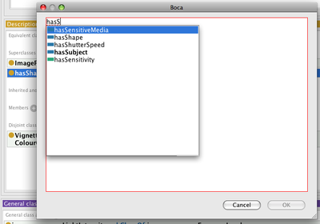

The expression editor is primarily used to create [https://www.w3.org/TR/owl2-syntax/#Class_Expressions OWL 2 class expressions], although it is also used for property expressions, axiom-level editing etc.

## Class expressions ##

Protege uses the [[Manchester_OWL_Syntax | Manchester OWL Syntax]] for all expressions.

Protege allows the user to create the full range of class expressions, wherever classes can be used in the interface:

* Classes: equivalent class, subclasses, disjoint classes
* Properties: domain, range
* Individuals: type (class assertions)

There are several inbuilt editors that hide the expression format from the user (such as the '''restriction creator''') that are useful when getting to know the tools, but they are not as powerful as the expression editor - for example, you can only select named fillers from the class hierarchy.

When used to the syntax, the expression editor can be a much faster way to create these class expressions (especially because of autocomplete).

## The Protege expression editor ##

To add a someValuesFrom restriction on a primitive class using the expression editor:
* select the class
* clicking the Add (+) next to the Superclasses section in the Class description view
* select the Class expression editor
* type "p some B" (where p and B are an object property and class respectively).

Protege will check that the expression is well formed before the value can be accepted and provides warning messages if not.

### Autocomplete ###

In order to get the syntax correct, search for candidate entities or ensure the correct spelling of a named thing in the ontology, an autocomplete feature has been implemented.

Use '''Ctrl-space''' (or '''tab''' in many circumstances) to attempt auto-complete in the expression editor.

If you have started typing a name it will search for names starting with the text you have entered (see right).

If multiple matches are made a dropdown appears and you can use '''up''' or '''down''' on the keyboard to select an entity (you can tell the type of the entity from the icon) and then '''return''' to accept.

If a single match is found autocomplete just fills in the result into the editor inline.

In either case, you can now continue typing.

Autocomplete also works for keywords and is good way of finding out which parenthesis or other punctuation can be used.

 

### Expression completion ###

[[Image:Expression-completion.png|right|400px]]

When you have entered an expression, it will be remembered by Protege for the rest of the session.

If you start another editor and you type something that matches a previously typed expression then this match will be suggested in the editor and highlighted (see right).

You can now:
* continue to type over the top of the suggested content (using autocomplete if you wish). It will disappear as soon as you deviate from the suggestion
* move to the end of the suggested content for further additions or editing by pressing '''right''' or '''down'''
* delete all of the suggested content by pressing '''backspace''' (of course it will reappear if what you are typing continues to match)
* accept the dialog using the suggested content by pressing '''Ctrl-return'''

'''Sidenote:'''

Protege will remember the expression as you typed it and will use this to render in the rest of the interface for the remainder of the session.

 

'''Back to [[Protege4UserDocs|Protege User Documentation]]'''
