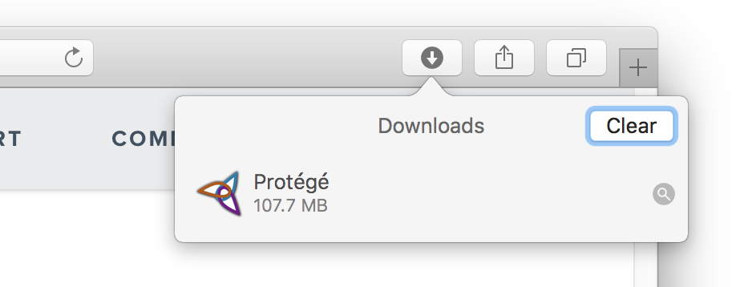
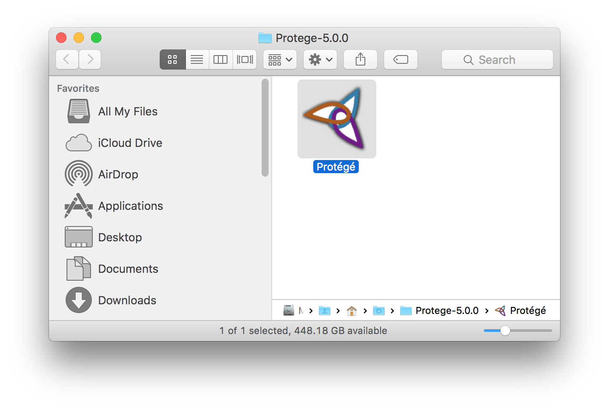

Installing Protégé on Mac OS X
==============================

Protege {{site.version}} is distributed in the form of a Mac OS X Application.  This includes the 64-bit Java Runtime Environment (JRE).  The application is contained within a ZIP file.

1. Go to the [download page](http://protege.stanford.edu/software.php#desktop-protege) and click the Download button.
2. Once the download completes, navigate to the folder where Protég´ was downloaded to. This will typically be your "Downloads" folder.
    <figure>
	  
	  <figcaption>The downloads list in the Safari Web Browser.  Click the magnifying glass to reveal the download.
	  </figcaption>
    </figure>
3. Once you have located the Protégé-{{site.version}} download folder you should see the Protégé Application.
    <figure>
	  
	  <figcaption>The Protégé application after downloading.</figcaption>
    </figure>
4. Drag the Protege Application to you Applications folder.
5. Double click Protege to start it.
