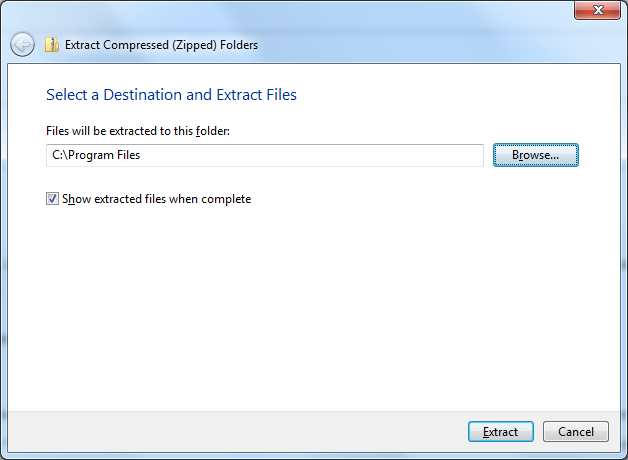

Installing Protégé on Windows
==============================

Protege {{site.version}} is distributed in the form of a ZIP file.  This includes the 64-bit Java Runtime Environment (JRE).

1. Go to the [download page](http://protege.stanford.edu/products.php#desktop-protege) and click the Download button.
2. Once the download completes, navigate to the folder where Protégé was downloaded to. This will typically be your "Downloads" folder.  For example, "C:/Users/[your-username]/Downloads".
3. Right-click on the Protégé-{{site.version}}.zip file and choose **Extract All...** from the popup menu to launch the Extract Compressed Folders dialog.
4. Click the "Browse..." button to select a destination for your Protégé Desktop installation, e.g., the "C:/Program Files" folder:
    <figure>
	  
	  <figcaption>Extract the Protégé ZIP file to "C:/Program Files".</figcaption>
    </figure>
4. Protege Desktop will be extracted to your selected destination into a folder called "Protege-{{site.version}}".
5. There are two ways to launch Protégé: (1) Double-click on the **Protege.exe**, or (2) Double-click on run.bat - which will start Protege also showing the console.
6. For quicker access to Protege Desktop going forward, right-click on the Protege.exe file and select **"Send to" -> "Desktop (create shortcut)"**. This will create a shortcut to Protege Desktop's launcher on your Windows Desktop.
